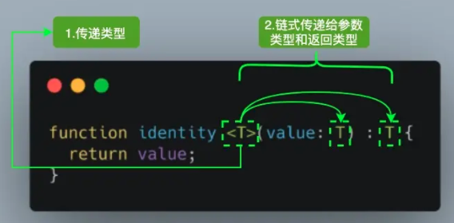
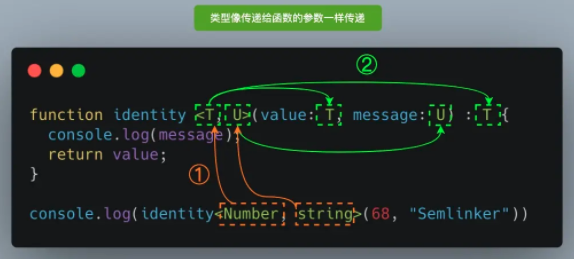

# typescript

## 安装

```bash
# 全局安装
npm i typescript -g

# 生成tsconfig.json
tsc --init
```

[命令](https://www.tslang.cn/docs/handbook/compiler-options.html)

### 编译配置表

```json
{
  "compilerOptions": {
    "incremental": true,                // 增量编译
    "tsBuildInfoFile": "./buildFile",   // 增量编译文件的存储位置
    "diagnostics": true,                // 打印编译信息

    "target": "es5",           // 目标语言的版本
    "module": "commonjs",      // 生成代码的模块标准
    "outFile": "./app.js",     // 将多个相互依赖的文件生成一个文件，可以用在 AMD 模块中

    "lib": [],                 // TS 需要引用的库，即声明文件，es5 默认 "dom", "es5", "scripthost"

    "allowJs": true,           // 允许编译 JS 文件（js、jsx）
    "checkJs": true,           // 允许在 JS 文件中报错，通常与 allowJS 一起使用
    "outDir": "./out",         // 指定输出目录
    "rootDir": "./",           // 指定输入文件目录（用于输出）

    "declaration": true,         // 生成声明文件
    "declarationDir": "./d",     // 声明文件的路径
    "emitDeclarationOnly": true, // 只生成声明文件
    "sourceMap": true,           // 生成目标文件的 sourceMap
    "inlineSourceMap": true,     // 生成目标文件的 inline sourceMap
    "declarationMap": true,      // 生成声明文件的 sourceMap
    "typeRoots": [],             // 声明文件目录，默认 node_modules/@types
    "types": [],                 // 声明文件包

    "removeComments": true,    // 删除注释

    "noEmit": true,            // 不输出文件
    "noEmitOnError": true,     // 发生错误时不输出文件

    "noEmitHelpers": true,     // 不生成 helper 函数，需额外安装 ts-helpers
    "importHelpers": true,     // 通过 tslib 引入 helper 函数，文件必须是模块

    "downlevelIteration": true,    // 降级遍历器的实现（es3/5）

    "strict": true,                        // 开启所有严格的类型检查
    "alwaysStrict": false,                 // 在代码中注入 "use strict";
    "noImplicitAny": false,                // 不允许隐式的 any 类型
    "strictNullChecks": false,             // 不允许把 null、undefined 赋值给其他类型变量
    "strictFunctionTypes": false,          // 不允许函数参数双向协变
    "strictPropertyInitialization": false, // 类的实例属性必须初始化
    "strictBindCallApply": false,          // 严格的 bind/call/apply 检查
    "noImplicitThis": false,               // 不允许 this 有隐式的 any 类型

    "noUnusedLocals": true,                // 检查只声明，未使用的局部变量
    "noUnusedParameters": true,            // 检查未使用的函数参数
    "noFallthroughCasesInSwitch": true,    // 防止 switch 语句贯穿
    "noImplicitReturns": true,             // 每个分支都要有返回值

    "esModuleInterop": true,               // 允许 export = 导出，由import from 导入
    "allowUmdGlobalAccess": true,          // 允许在模块中访问 UMD 全局变量
    "moduleResolution": "node",            // 模块解析策略
    "baseUrl": "./",                       // 解析非相对模块的基地址
    "paths": {                             // 路径映射，相对于 baseUrl
      "jquery": ["node_modules/jquery/dist/jquery.slim.min.js"]
    },
    "rootDirs": ["src", "util"],           // 将多个目录放在一个虚拟目录下，用于运行时

    "listEmittedFiles": true,        // 打印输出的文件
    "listFiles": true,               // 打印编译的文件（包括引用的声明文件）
  }
}
```

## 

## 关键字

### extends

```ts
// 1.用于继承
interface Person {
    name: string;
    age: number;
}

interface Player extends Person {
    item: 'ball' | 'swing';
}


// 2.判断是否是能赋值给另一个类型
// 如果 T 可以满足类型 Person 则返回 Person 类型，否则为 T 类型
type IsPerson<T> = T extends Person ? Person : T;
```

### typeof

> 在 TS 中用于类型表达时，`typeof` 可以用于从一个变量上获取它的类型。

```ts
const value: number = 10;
const value2: typeof value = 100; 
// const value2: number


const value = 10;
const value2: typeof value = 100;       
// const value2: 10
// ERROR: Type '100' is not assignable to type '10'
// 经测试，number string boolean 类型在没有声明而直接赋值的情况下，都会存在这个问题


// 对于对象，数组，函数类型来讲，这个还是有点用的。
const data = {
  value: 123,
  text: 'text',
  subData: {
    value: false
  }
};

type Data = typeof data;

// type Data = {
//   value: number;
//   text: string;
//   subData: {
//     value: boolean;
//   };
// }
```

### keyof

> `keyof` 是TS中的索引类型查询操作符。`keyof T` 会得到由 `T` 上已知的公共属性名组成的联合类型。

```ts
// 示例1
interface Person {
    name: string;
    age: number;
    phoneNum: number;
}

type PersonProperty = keyof Person;
// type PersonProperty = "name" | "age" | "phoneNum"


// 示例2
// T[K] 在TS里称作索引访问操作符（indexed access operator）。
// 它可以为我们准确解析目标对象上的对应属性的正确类型。
function getProperty<T, K extends keyof T>(obj: T, key: K): T[K] {
    return obj[key];
}
```

### in

> `in` 操作符用于遍历目标类型的公开属性名。类似 `for .. in` 的机制。
> 
> 容易想到 `in` 可用于联合类型或者枚举类型。

#### 使用于枚举类型

```ts
enum Letter {
    A,
    B,
    C,
}

type LetterMap = {
    [key in Letter]: string;
}

// type LetterMap = {
//     0: string;
//     1: string;
//     2: string;
// }
```

#### 使用于联合类型

```ts
type Property = 'name' | 'age' | 'phoneNum';

type PropertyObject = {
    [key in Property]: string;
}

// type PropertyObject = {
//     name: string;
//     age: string;
//     phoneNum: string;
// }
```

#### 使用于基础类型

> TypeScript 的索引签名必须是 `string` 、 `number`、`symbol`。

```ts
type StringKey = {
    [key in string]: any;
}

// type StringKey = {
//     [x: string]: any;
// }


type NumberKey =  {
    [key in number]: any;
}

// type NumberKey = {
//     [x: number]: any;
// }


type SymbolKey = {
    [key in symbol]: any;
}


// type SymbolKey = {
//     [x: symbol]: any;
// }
```

### is

`is` 操作符用于TS的类型谓词中，是实现TS类型保护的一种方式。

```ts
/**
 * 此函数用于判断参数 value 是不是 string 类型
 * 
 * 由于返回类型声明了类型谓词
   可以帮助TS在代码分支中进行类型保护（默认返回 boolean 类型是没办法做到的）
 **/
function isString(value: any): value is string {
    return typeof value === 'string';
}

function doSometing(value: string | number) {
    if (isString(value)) {
        // TS 可以识别这个分支中 value 是 string 类型的参数（这就叫类型保护）
    } else {
        // TS 可以识别这个分支中 value 是 number 类型的参数
    }
}
```

### infer

表示在 `extends` 条件语句中待推断的类型变量。

```ts
type ParamType<T> = T extends (...args: infer P) => any ? P : T;

// 在这个条件语句 T extends (...args: infer P) => any ? P : T 中，
// infer P 表示待推断的函数参数。


// 整句表示为：如果 T 能赋值给 (...args: infer P) => any，
// 则结果是 (...args: infer P) => any 类型中的参数 P，否则返回为 T。
```

## 泛型

### 函数泛型

#### 例子1:

```ts
function identity <T>(value: T) : T {
  return value;
}

console.log(identity<Number>(1)) // 1
```



#### 例子2：

```ts
function identity <T, U>(value: T, message: U) : T {
  console.log(message);
  return value;
}

console.log(identity<Number, string>(68, "Semlinker"));
```



### 接口泛型

```ts
interface Identities<V, M> {
  value: V,
  message: M
}

// 函数
function identity<T, U> (value: T, message: U): Identities<T, U> {
  let identities: Identities<T, U> = {
    value,
    message
  };

  return identities;
}

console.log(identity(68, "Semlinker"));
```

### 泛型约束

通过 `keyof` 操作符，我们就可以获取指定类型的所有键，之后我们就可以结合前面介绍的 `extends` 约束，即限制输入的属性名包含在 `keyof` 返回的联合类型中。

```ts
function getProperty<T, K extends keyof T>(obj: T, key: K): T[K] {
  return obj[key];
}
```

### 泛型参数默认类型

泛型参数默认类型与普通函数默认值类似，即 `<T=Default Type>`。

```ts
interface A<T=string> {
  name: T;
}

const strA: A = { name: "Semlinker" };
const numB: A<number> = { name: 101 };
```

泛型参数的默认类型遵循以下规则：

- 有默认类型的类型参数被认为是可选的。
- 必选的类型参数不能在可选的类型参数后。
- 如果类型参数有约束，类型参数的默认类型必须满足这个约束。
- 当指定类型实参时，你只需要指定必选类型参数的类型实参。 未指定的类型参数会被解析为它们的默认类型。
- 如果指定了默认类型，且类型推断无法选择一个候选类型，那么将使用默认类型作为推断结果。
- 一个被现有类或接口合并的类或者接口的声明可以为现有类型参数引入默认类型。
- 一个被现有类或接口合并的类或者接口的声明可以引入新的类型参数，只要它指定了默认类型。

### 泛型条件类型

```ts
// 若 T 能够赋值给 U，那么类型是 X，否则为 Y。
// 在条件类型表达式中，我们通常还会结合 infer 关键字，
T extends U ? X : Y
```

## 其他

[对比理解Typescript中的as、问号与叹号 - 掘金](https://juejin.cn/post/6844904068951834632)

https://mp.weixin.qq.com/s/VUUoUkQNt_3g6YOWJtTDDg

[type 与 interface 的区别，你真的懂了吗？](https://mp.weixin.qq.com/s/J6xHq9g91_TLgQLE6P_Teg)

[TypeScript中implements与extends的区别 - 掘金](https://juejin.cn/post/6914213447169376263)
