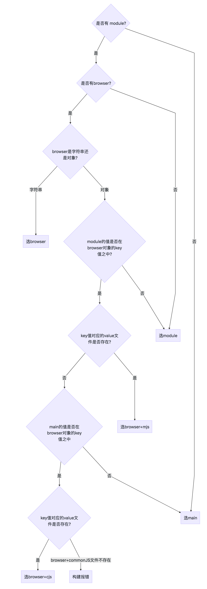

# `browser`，`module` 和 `main` 字段

## 文件优先级

由于我们使用的模块规范有 ESM 和 commonJS 两种，为了能在 node 环境下原生执行 ESM 规范的脚本文件，`.mjs` 文件就应运而生。

当存在 `index.mjs` 和 `index.js` 这种同名不同后缀的文件时，`import './index'` 或者 `require('./index')` 是会优先加载 `index.mjs` 文件的。

也就是说，优先级 **`mjs` > `js`**

## 字段定义

- `main` : 定义了 `npm` 包的入口文件，browser 环境和 node 环境均可使用
- `module` : 定义 `npm` 包的 ESM 规范的入口文件，browser 环境和 node 环境均可使用
- `browser` : 定义 `npm` 包在 browser 环境下的入口文件

## 使用场景与优先级

首先，我们假定 `npm` 包 `test` 有以下目录结构

```
----- lib
   |-- index.browser.js
   |-- index.browser.mjs
   |-- index.js
   |-- index.mjs
```

其中 `*.js` 文件是使用 commonJS 规范的语法(`require('xxx')`)，`*.mjs` 是用 ESM 规范的语法(`import 'xxx'`)

其 package.json 文件：

```js
  "main": "lib/index.js",  // main 
  "module": "lib/index.mjs", // module

  // browser 可定义成和 main/module 字段一一对应的映射对象，也可以直接定义为字符串
  "browser": {
    "./lib/index.js": "./lib/index.browser.js", // browser+cjs
    "./lib/index.mjs": "./lib/index.browser.mjs"  // browser+mjs
  },

  // "browser": "./lib/index.browser.js" // browser
```

根据上述配置，那么其实我们的 `package.json` 指定的入口可以有

- `main`
- `module`
- `browser`
- `browser+cjs`
- `browser+mjs`  
  这 5 种情况。

### webpack + web + ESM

这是我们最常见的使用场景，通过 `webpack` 打包构建我们的 web 应用，模块语法使用 ESM

当我们加载

```
import test from 'test'
```

实际上的加载优先级是 **`browser` = `browser+mjs` > `module` > `browser+cjs` > `main`**  
也就是说 webpack 会根据这个顺序去寻找字段指定的文件，直到找到为止。

然而实际上的情况可能比这个更加复杂，具体可以参考流程图



### webpack + web + commonJS

```
const test = require('test')
```

事实上，构建 web 应用时，使用 `ESM` 或者 `commonJS` 模块规范对于加载优先级并没有任何影响

优先级依然是 **`browser` = `browser+mjs` > `module` > `browser+cjs` > `main`**

### webpack + node + ESM/commonJS

我们清楚，使用 webpack 构建项目的时候，有一个 [target](https://webpack.js.org/configuration/target/) 选项，默认为 web，即进行 web 应用构建。

当我们需要进行一些 同构项目，或者其他 node 项目的构建的时候，我们需要将 `webpack.config.js` 的 `target` 选项设置为 `node` 进行构建。

```
import test from 'test'
// 或者 const test = require('test')
```

优先级是： **module > main**

### node + commonJS

通过 `node test.js` 直接执行脚本

```
const test = require('test')
```

**只有 main 字段有效。**

### node + ESM

通过 `--experimental-modules` 可以让 node 执行 ESM 规范的脚本(必须是 mjs 文件后缀)  
`node --experimental-modules test.mjs

```
import test from 'test'
```

**只有 main 字段有效。**

# 总结

- 如果 `npm` 包导出的是 ESM 规范的包，使用 module
- 如果 `npm` 包只在 web 端使用，并且严禁在 server 端使用，使用 browser。
- 如果 `npm` 包只在 server 端使用，使用 main
- 如果 `npm` 包在 web 端和 server 端都允许使用，使用 browser 和 main
- 其他更加复杂的情况，如`npm` 包需要提供 commonJS 与 ESM 等多个规范的代码文件，请参考上述使用场景或流程图
