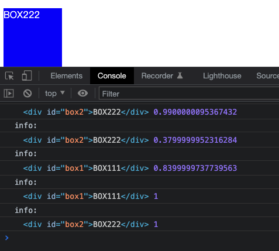
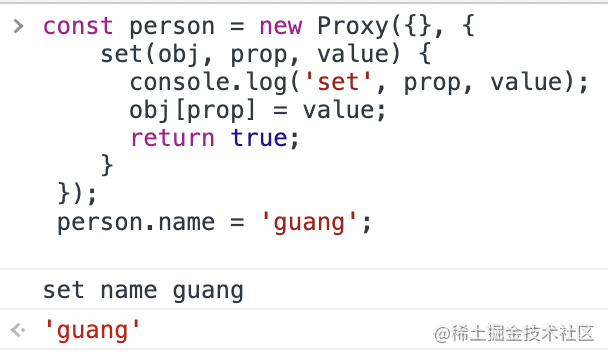
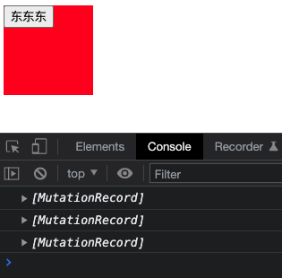
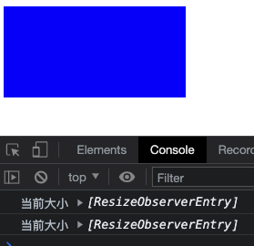
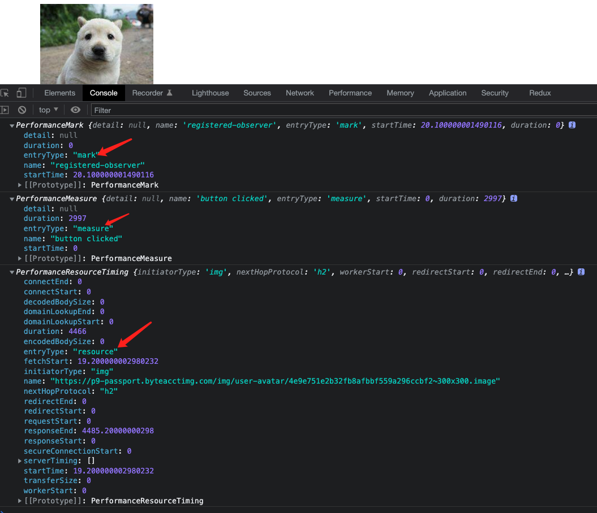

# 浏览器的 5 种 Observer

## IntersectionObserver

一个元素从不可见到可见，从可见到不可见，这种变化如何监听呢？

IntersectionObserver 可以监听一个元素和可视区域相交部分的比例，然后在可视比例达到某个阈值的时候触发回调。

demo：

```html
<div id="box1">BOX111</div>
<div id="box2">BOX222</div>
```

```css
#box1,#box2 {
    width: 100px;
    height: 100px;
    background: blue;
    color: #fff;

    position: relative;
}
#box1 {
    top: 500px;
}
#box2 {
    top: 800px;
}
```

```js
const intersectionObserver = new IntersectionObserver(
    function (entries) {
        console.log('info:');
        entries.forEach(item => {
            console.log(item.target, item.intersectionRatio)
        })
    }, {
    threshold: [0.5, 1]
});

intersectionObserver.observe( document.querySelector('#box1'));
intersectionObserver.observe( document.querySelector('#box2'));
```



可以看到元素 box1 和 box2 在可视范围达到一半（0.5）和全部（1）的时候分别触发了回调。


我们在做一些数据采集的时候，希望知道某个元素是否是可见的，什么时候可见的，就可以用这个 api 来监听，还有做图片的懒加载的时候，可以当可视比例达到某个比例再触发加载。

除了可以监听元素可见性，还可以监听元素的属性和子节点的改变。


## MutationObserver

监听一个普通 JS 对象的变化，我们会用 Object.defineProperty 或者 Proxy：



而监听元素的属性和子节点的变化，我们可以用 MutationObserver：

**MutationObserver 可以监听对元素的属性的修改、对它的子节点的增删改。**

demo:

```html
<div id="box"><button>光</button></div>
```

```css
 #box {
    width: 100px;
    height: 100px;
    background: blue;

    position: relative;
}
```

```js
setTimeout(() => {
    box.style.background = 'red';
},2000);

setTimeout(() => {
    const dom = document.createElement('button');
    dom.textContent = '东东东';
    box.appendChild(dom);
},3000);

setTimeout(() => {
   document.querySelectorAll('button')[0].remove();
},5000);

// 监听他的变化
const mutationObserver = new MutationObserver((mutationsList) => {
    console.log(mutationsList)
});

mutationObserver.observe(box, {
    attributes: true,
    childList: true
});
```



这个可以用来做什么呢？比如文章水印被人通过 devtools 去掉了，那么就可以通过 MutationObserver 监听这个变化，然后重新加上，让水印去不掉。

除了监听元素的可见性、属性和子节点的变化，还可以监听大小变化。


## ResizeObserver

窗口我们可以用 addEventListener 监听 resize 事件，那元素呢？

**元素可以用 ResizeObserver 监听大小的改变，当 width、height 被修改时会触发回调。**

demo:

```html
<div id="box"></div>
```

```css
#box {
    width: 100px;
    height: 100px;
    background: blue;
}
```

```js
const box = document.querySelector('#box');

setTimeout(() => {
    box.style.width = '200px';
}, 3000);

const resizeObserver = new ResizeObserver(entries => {
    console.log('当前大小', entries)
});
resizeObserver.observe(box);
```



可以拿到元素和它的位置、尺寸。

这样我们就实现了对元素的 resize 的监听。

除了元素的大小、可见性、属性子节点等变化的监听外，还支持对 performance 录制行为的监听。


## PerformanceObserver

浏览器提供了 performance 的 api 用于记录一些时间点、某个时间段、资源加载的耗时等。

我们希望记录了 performance 那就马上上报，可是怎么知道啥时候会记录 performance 数据呢？

用 PeformanceObserver。

**PerformanceObserver 用于监听记录 performance 数据的行为，一旦记录了就会触发回调，这样我们就可以在回调里把这些数据上报。**

比如 performance 可以用 mark 方法记录某个时间点：

```js
performance.mark('registered-observer');
```

用 measure 方法记录某个时间段：

```js
performance.measure('button clicked', 'from', 'to');
```

后两个参数是时间点，不传代表从开始到现在。

我们可以用 PerformanceObserver 监听它们：

```html
<html>
<body>
  <button onclick="measureClick()">Measure</button>

  

  <script>
    const performanceObserver = new PerformanceObserver(list => {
      list.getEntries().forEach(entry => {
        console.log(entry);// 上报
      })
    });
    performanceObserver.observe({
        entryTypes: ['resource', 'mark', 'measure']
    });

    performance.mark('registered-observer');

    function measureClick() {
      performance.measure('button clicked');
    }
  </script>
</body>
</html>
```

创建 PerformanceObserver 对象，监听 mark（时间点）、measure（时间段）、resource（资源加载耗时） 这三种记录时间的行为。

然后我们用 mark 记录了某个时间点，点击 button 的时候用 measure 记录了某个时间段的数据，还加载了一个图片。



当这些记录行为发生的时候，希望能触发回调，在里面可以上报。


## ReportingObserver

- 当浏览器运行到过时（deprecation）的 api 的时候，会在控制台打印一个过时的报告。

- 浏览器还会在一些情况下对网页行为做一些干预（intervention），比如会把占用 cpu 太多的广告的 iframe 删掉。

- 会在网络比较慢的时候把图片替换为占位图片，点击才会加载。

这些干预都是浏览器做的，会在控制台打印一个报告。

这些干预或者过时的 api 并不是报错，所以不能用错误监听的方式来拿到，但这些情况对网页 app 来说可能也是很重要的：

比如我这个网页就是为了展示广告的，但浏览器一干预给我把广告删掉了，我却不知道。如果我知道的话或许可以优化下 iframe。

比如我这个网页的图片很重要，结果浏览器一干预给我换成占位图了，我却不知道。如果我知道的话可能会优化下图片大小。

所以自然也要监听，所以浏览器提供了 ReportingObserver 的 api 用来监听这些报告的打印，我们可以拿到这些报告然后上传。

```js
const reportingObserver = new ReportingObserver((reports, observer) => {
    for (const report of reports) {
        console.log(report.body);//上报
    }
}, {types: ['intervention', 'deprecation']});

reportingObserver.observe();

```

**ReportingObserver 可以监听过时的 api、浏览器干预等报告等的打印，在回调里上报，这些是错误监听无法监听到但对了解网页运行情况很有用的数据。**


## 总结

监听用户的交互行为，我们会用 addEventListener 来监听 click、mousedown、keydown、input 等事件，但对于元素的变化、performance 的记录、浏览器干预行为这些不是用户交互的事件就要用 XxxObserver 的 api 了。

浏览器提供了这 5 种 Observer：

- IntersectionObserver：监听元素可见性变化，常用来做元素显示的数据采集、图片的懒加载

- MutationObserver：监听元素属性和子节点变化，比如可以用来做去不掉的水印

- ResizeObserver：监听元素大小变化

还有两个与元素无关的：

- PerformanceObserver：监听 performance 记录的行为，来上报数据

- ReportingObserver：监听过时的 api、浏览器的一些干预行为的报告，可以让我们更全面的了解网页 app 的运行情况


