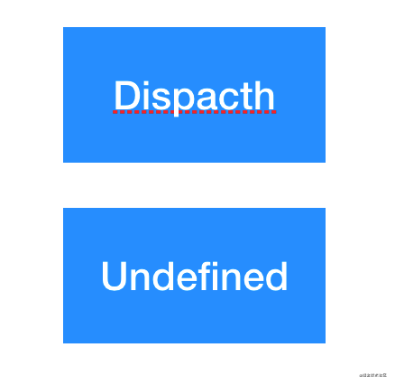
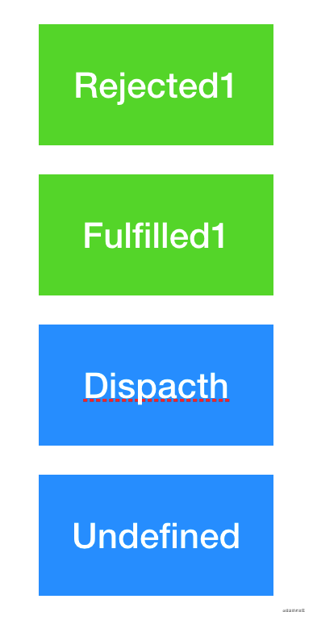

# axios-手写简易版

由于axios源码中有很多不是很重要的方法，而且很多方法为了考虑兼容性，并没有考虑到用es6 的语法去写。本篇主要是带你去梳理axios的主要流程，并用es6重写简易版axios

- 拦截器

- 适配器

- 取消请求


## 拦截器

一个axios实例上有两个拦截器，一个是请求拦截器， 然后响应拦截器。我们下看下官网的用法：

添加拦截器

```js
// 添加请求拦截器
axios.interceptors.request.use(function (config) {
    // 在发送请求之前做些什么
    return config;
  }, function (error) {
    // 对请求错误做些什么
    return Promise.reject(error);
  });
```

移除拦截器

```js
const myInterceptor = axios.interceptors.request.use(function () {
    /*...*/
});
axios.interceptors.request.eject(myInterceptor);
```

其实源码中就是，所有拦截器的执行 所以说肯定有一个forEach方法。

```js
export class InterceptorManager {
  constructor() {
    // 存放所有拦截器的栈
    this.handlers = []
  }

  use(fulfilled, rejected) {
    this.handlers.push({
      fulfilled,
      rejected,
    })
    
    //返回id 便于取消
    return this.handlers.length - 1
  }

  // 取消一个拦截器
  eject(id) {
    if (this.handlers[id]) {
      this.handlers[id] = null
    }
  }

  // 执行栈中所有的hanlder
  forEach(fn) {
    this.handlers.forEach((item) => {
      // 这里为了过滤已经被取消的拦截器，因为已经取消的拦截器被置null
      if (item) {
        fn(item)
      }
    })
  }
}
```

拦截器这个类我们已经初步实现了，现在我们去实现axios 这个类，还是先看下官方文档，先看用法，再去分析。


## axios(config)

```js
// 发送 POST 请求
axios({
  method: 'post',
  url: '/user/123',
  data: {
    firstName: 'name1',
    lastName: 'name2'
  }
});
```

axios(url[, config])

```js
// 发送 GET 请求（默认的方法） 
axios('/user/123');
```

Axios 这个类最核心的方法其实还是 request 这个方法。实现：

```js
class Axios {
  constructor(config) {
    this.defaults = config
    this.interceptors = {
      request: new InterceptorManager(),
      response: new InterceptorManager(),
    }
  }

  // 发送一个请求
  request(config) {
    // 这里呢其实就是去处理了 axios(url[,config])
    if (typeof config == 'string') {
      config = arguments[1] || {}
      config.url = arguments[0]
    } else {
      config = config || {}
    }

    // 默认get请求，并且都转成小写
    if (config.method) {
      config.method = config.method.toLowerCase()
    } else {
      config.method = 'get'
    }

    // dispatchRequest 就是发送ajax请求
    const chain = [dispatchRequest, undefined]
    //  发生请求之前加入拦截的 fulfille 和reject 函数
    this.interceptors.request.forEach((item) => {
      chain.unshift(item.fulfilled, item.rejected)
    })
    // 在请求之后增加 fulfilled 和reject 函数
    this.interceptors.response.forEach((item) => {
      chain.push(item.fulfilled, item.rejected)
    })

    // 利用promise的链式调用，将参数一层一层传下去
    let promise = Promise.resolve(config)

    //然后我去遍历 chain
    while (chain.length) {
      // 这里不断出栈 直到结束为止
      promise = promise.then(chain.shift(), chain.shift())
    }
    return promise
  }
}
```

这里其实就是体现了axios设计的巧妙， 维护一个栈结构 + promise 的链式调用 实现了 拦截器的功能， 可能有的小伙伴到这里还是不是很能理解，我还是给大家画一个草图去模拟下这个过程。

假设我有1个请求拦截器handler和1个响应拦截器handler。

一开始我们栈中的数据就两个:



这个没什么问题，由于有拦截器的存在，如果存在的话，那么我们就要往这个栈中加数据，请求拦截器顾名思义要在请求之前所以是unshift。加完请求拦截器我们的栈变成了这样:



没什么问题，然后请求结束后，我们又想对请求之后的数据做处理，所以响应拦截的数据自然是push了。这时候栈结构变成了这样：


然后遍历整个栈结构，每次出栈都是一对出栈， 因为promise 的then 就是 一个成功，一个失败嘛。遍历结束后，返回经过所有处理的promise，然后你就可以拿到最终的值了。


## adapter

Adapter: 英文解释是适配器的意思。看一下源码。adapter 做了一件事非常简单，就是根据不同的环境 使用不同的请求。如果用户自定义了adapter，就用config.adapter。否则就是默认是default.adpter。

```js
var adapter = config.adapter || defaults.adapter;
return adapter(config).then() ...
```

看deafults.adapter做了什么事情：

```js
function getDefaultAdapter() {
  var adapter;
  if (typeof XMLHttpRequest !== 'undefined') {
    // For browsers use XHR adapter
    adapter = require('./adapters/xhr');
  } else if (typeof process !== 'undefined'
    && Object.prototype.toString.call(process) === '[object process]'
  ) {
    // For node use HTTP adapter
    adapter = require('./adapters/http');
  }
  return adapter;
}
```

其实就是做个选择：如果是浏览器环境：就是用xhr 否则就是node 环境。判断process是否存在。从写代码的角度来说，axios源码的这里的设计可扩展性非常好。有点像设计模式中的适配器模式， 因为浏览器端和node 端 发送请求其实并不一样， 但是我们不重要，我们不去管他的内部实现，用promise包一层做到对外统一。所以 我们用axios 自定义adapter 器的时候, 一定是返回一个promise。


## cancleToken

取消请求原生浏览器是怎么做到的？有一个abort 方法。可以取消请求。那么axios源码肯定也是运用了这一点去取消请求。现在浏览器其实也支持fetch请求， fetch可以取消请求？很多同学说是不可以的，其实不是？fetch 结合 abortController 可以实现取消fetch请求。我们看下例子：

```js
const controller = new AbortController();
const { signal } = controller;

fetch("http://localhost:8000", { signal }).then(response => {
    console.log(`Request 1 is complete!`);
}).catch(e => {
    console.warn(`Fetch 1 error: ${e.message}`);
});
// Wait 2 seconds to abort both requests
setTimeout(() => controller.abort(), 2000);

```

但是这是个实验性功能，可恶的ie。所以我们这次还是用原生的浏览器xhr基于promise简单的封装一下。代码如下：

```js
export function dispatchRequest(config) {
  return new Promise((resolve, reject) => {
    const xhr = new XMLHttpRequest()
    xhr.open(config.method, config.url)
    xhr.onreadystatechange = function () {
      if(xhr.status >= 200 && xhr.status <= 300 && xhr.readyState === 4){
        resolve(xhr.responseText)
      } else {
        reject('失败了')
      }
    }

    if (config.cancelToken) {
      // Handle cancellation
      config.cancelToken.promise.then(function onCanceled(cancel) {
        if (!xhr) {
          return
        }
        xhr.abort()
        reject(cancel)
        // Clean up request
        xhr = null
      })
    }
    xhr.send()
  })
}
```

Axios 源码里面做了很多处理， 这里只做了get处理，主要的目的就是为了axios是如何取消请求的。先看下官方用法:

主要是两种用法：

- 使用 *cancel token* 取消请求
  
  ```js
  const CancelToken = axios.CancelToken;
  const source = CancelToken.source();
  
  axios.get('/user/12345', {
    cancelToken: source.token
  }).catch(function(thrown) {
    if (axios.isCancel(thrown)) {
      console.log('Request canceled', thrown.message);
    } else {
       // 处理错误
    }
  });
  
  axios.post('/user/12345', {
    name: 'new name'
  }, {
    cancelToken: source.token
  })
  
  // 取消请求（message 参数是可选的）
  source.cancel('Operation canceled by the user.');
  ```

- 还可以通过传递一个 executor 函数到 `CancelToken` 的构造函数来创建 cancel token：
  
  ```js
  const CancelToken = axios.CancelToken;
  let cancel;
  
  axios.get('/user/12345', {
    cancelToken: new CancelToken(function executor(c) {
      // executor 函数接收一个 cancel 函数作为参数
      cancel = c;
    })
  });
  
  // cancel the request
  cancel();
  ```

看了官方用法 和结合axios源码：给出以下实现:

```js
export class cancelToken {
    constructor(exactor) {
        if (typeof executor !== 'function') {
            throw new TypeError('executor must be a function.')
        }
        // 这里其实将promise的控制权 交给 cancel 函数
        // 同时做了防止多次重复cancel 之前 Redux 还有React 源码中也有类似的案列
        let resolvePromise;
        this.promise =  new Promise(resolve => {
            resolvePromise = resolve;
        })
        this.reason = undefined;
        
        const cancel  = (message) => {
            if(this.reason) {
                return;
            }
            this.reason = 'cancel' + message;
            resolvePromise(this.reason);
        }
        exactor(cancel)
    }

    throwIfRequested() {
        if(this.reason) {
            throw this.reason
        }
    }
    
    // source 其实本质上是一个语法糖 里面做了封装
    static source() {
        const cancel;
        const token = new cancelToken(function executor(c) {
            cancel = c;
        });
        return {
            token: token,
            cancel: cancel
        };
    }

}
```


## 源码待梳理？？


